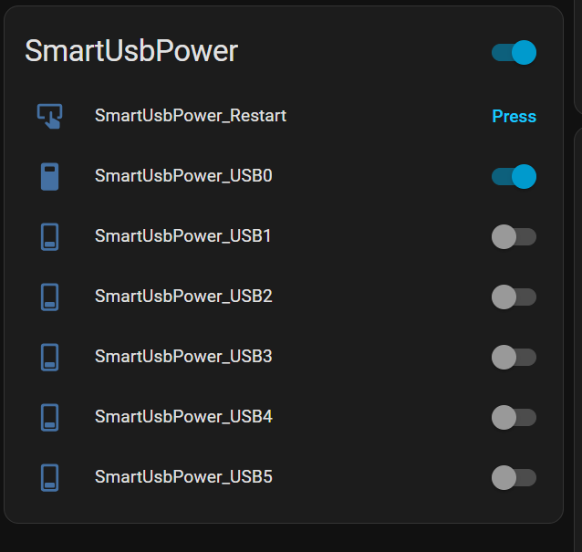
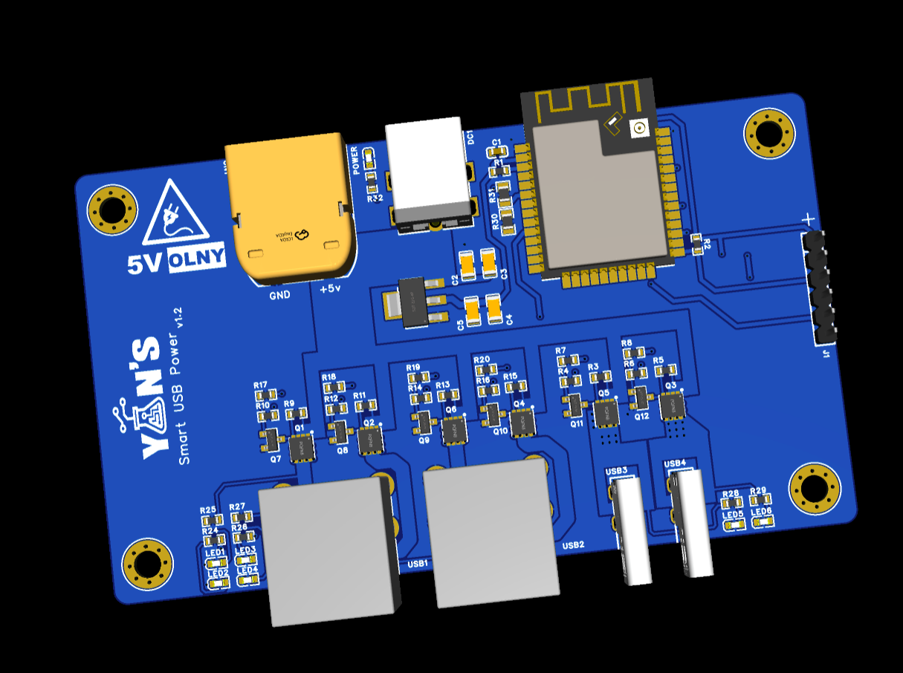
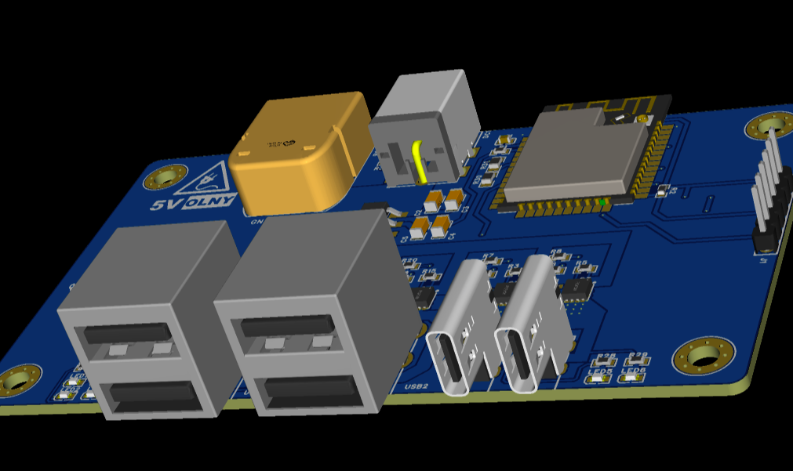

# SmartUsbPower

**ESP32-based Smart USB Power Controller with Home Assistant (MQTT)**
**基于 ESP32 的智能 USB 电源控制器，支持 Home Assistant（MQTT）**

------

## Features | 功能特性

- 🔌 **6-Channel USB Power Control** – Independent ON/OFF control
  **6 路 USB 电源独立控制**
- 🏠 **Home Assistant MQTT Auto Discovery**
  **Home Assistant MQTT 自动发现**
- 🔄 **State Restore After Reboot**
  **重启后状态保持**
- ⏱ **Uptime Monitoring**
  **设备运行时间统计**
- 🔁 **Remote Restart**
  **支持远程重启设备**
- 📡 **WiFi / MQTT Auto Reconnect**
  **WiFi / MQTT 自动重连**
- 🌐 **HTTP OTA Firmware Update**
  **HTTP 在线固件升级（OTA）**
- 

------

## Configuration | 配置说明

Before flashing firmware, configure the following in source code:
烧录前请在源码中配置以下内容：

- WiFi SSID / Password
- MQTT Broker 地址与账号信息
- Device Name（设备名）

------

## Home Assistant Integration | Home Assistant 集成

### Switches | 开关（6 个）

- `switch.smartusbpower_usb0` ~ `switch.smartusbpower_usb5`
- Control each USB port power ON / OFF
  独立控制每一路 USB 电源

### Sensor | 传感器

- `sensor.smartusbpower_uptime`
  Device uptime display / 设备运行时间

### Button | 按钮

- `button.smartusbpower_restart`
  Restart device remotely / 远程重启设备

### Device Info | 设备信息

- Firmware version / 固件版本
- Online / Offline availability / 在线状态

------

## MQTT Overview | MQTT 说明

- Uses **Home Assistant MQTT Discovery**
  使用 Home Assistant MQTT 自动发现
- Retained messages for switch state
  使用 Retain 保持开关状态
- Availability reports `online / offline`
  上报设备在线状态

> No manual YAML configuration required
> 无需手动编写 YAML 配置

------

## Version | 版本

- **v2.1**

------

## License | 许可证

MIT (or your preferred license)

------

> Designed for DIY smart USB power distribution with Home Assistant.
> 面向 Home Assistant 的 DIY 智能 USB 电源管理方案。